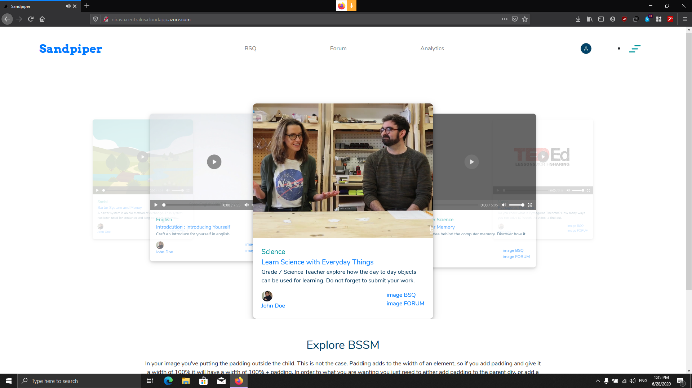

Reimagining online classrooms with bite-sized study materials, inteligent questionares, performance assessments at every level, and student-first design. Hoisting education up to include 21st century skills like critical thinking, collaboration and AI driven content, while still being incrementally adoptable in everyday classrooms.



## Getting Started

First, run the development server:

```bash
npm run dev
# or
yarn dev
```
